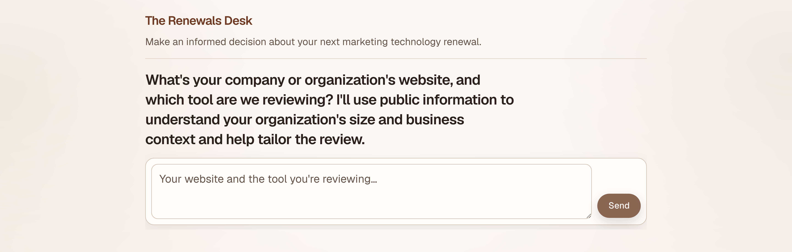
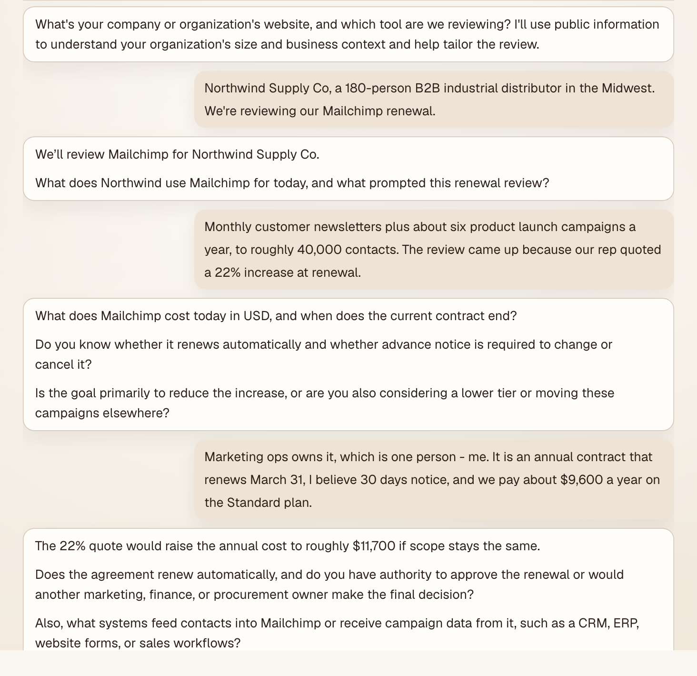

# The Renewals Desk

**Live product:** [https://www.therenewalsdesk.com](https://www.therenewalsdesk.com)

A focused web chatbot that helps marketing operations and martech leaders decide what to do about **one** SaaS renewal at a time. It turns scattered ownership, usage, cost, dependency, and contract facts into a short, decision-ready assessment with a clear next step.

This repository is a **portfolio showcase** (product narrative and architecture). Application source code is private.



One question to start. The desk takes the company website and the tool under review, then researches
both from public sources before it begins asking anything that needs a human answer.



Intake asks only what could change the recommendation, and follows up on the answers rather than
working through a fixed form. Commercial arithmetic is done in application code, not by the model —
here it turns a quoted 22% increase into the actual renewal figure. The example above uses a
fictional company.

---

## Problem

Renewal decisions are hard when evidence is incomplete and spread across Marketing Ops, IT, Finance, Procurement, and Legal. Feature overlap alone does not prove a tool can be removed safely. Leaders need a timely recommendation that is honest about confidence, tradeoffs, and what still needs to be confirmed.

## What it does

1. **Intake conversation** — Asks for the company (or website) and the tool under review, then gathers purpose, ownership, commercial terms, usage, dependencies, overlap candidates, and vendor context through consequential follow-ups (typed or pasted text only; no file uploads).
2. **Structured evidence** — Maintains an in-session evidence record with value, source, and state (answered, unknown, conflicting, not yet asked). Does not invent missing contract terms.
3. **Public research** — At defined milestones, researches the company and the vendor/product into the evidence record (with sources), without dumping research into the chat.
4. **Deterministic deadline math** — Calculates notice deadlines and runway in application code (not via the language model), and surfaces timing when it materially matters.
5. **Formal assessment** — A separate assessment pass produces a compact write-up:
   - Immediate contract action (renew, renegotiate, extend, defer, or do not renew)
   - Longer-term direction (retain, sunset, consolidate, or investigate further)
   - Reasoning and evidence (supported, provisional, or insufficient information)
   - Action plan with owners and next steps
6. **Revision** — New evidence updates the recommendation; older assessments are superseded in the thread.

Sessions are **not saved** after the tab closes. Organizational approval stays with the user.

---

## Architecture (high level)

```text
┌─────────────────────────────────────────────────────────┐
│  Browser (Next.js App Router UI)                        │
│  • Single-column chat shell                             │
│  • In-memory session evidence + messages                │
│  • Streams assistant replies and assessments            │
└───────────────────────────┬─────────────────────────────┘
                            │
                            ▼
┌─────────────────────────────────────────────────────────┐
│  API layer                                              │
│  • Chat          → streaming intake replies             │
│  • Extract       → structured evidence updates          │
│  • Research      → milestone company / vendor research  │
│  • Assess        → streaming formal assessment          │
│  • Bot-focused rate limits on public API routes         │
└───────────────────────────┬─────────────────────────────┘
                            │
                            ▼
┌─────────────────────────────────────────────────────────┐
│  Domain logic                                           │
│  • Evidence merge and conflict handling                 │
│  • Commercial-term and notice-deadline calculation      │
│  • Assessment readiness / handoff                       │
│  • Role-separated model calls (chat, extract,           │
│    research, assessment) via configuration              │
└─────────────────────────────────────────────────────────┘
```

**Design choices that matter for the product:**

| Choice | Why |
|--------|-----|
| Intake and assessment are separate passes | Questions stay investigative; the formal write-up stays compact and consistent |
| Deadline arithmetic is deterministic | Avoids LLM date errors; runway uses the user’s local calendar date |
| Research lands in evidence, not chat dumps | Keeps the conversation readable while still grounding recommendations |
| Session-only state | Fits a focused review tool without accounts or stored customer data |
| Scoped to one tool per review | Prevents whole-stack sprawl; overlap is discussed only as it affects the renewal |

---

## Features

- Focused renewal chatbot for B2B marketing technology decisions
- Warm, desk-inspired UI (mahogany / ivory) with clear brand hierarchy
- Streaming responses for chat and assessment
- Markdown rendering for readable assistant replies
- In-session structured evidence across intake categories
- Milestone-based company and vendor web research with sources
- Application-calculated notice deadline and runway when timing is known
- Four-section assessment with copy-to-clipboard
- Clear recommendation confidence: supported, provisional, or insufficient information
- Safeguards against inventing contract terms, overstating utilization as low value, and consolidating without workflow and capacity checks
- Public API rate limiting oriented at bots, not normal human use

**Out of scope (by design):** file uploads, live account connectors, vendor outreach, contract execution, whole-stack audits, and replacing human organizational approval.

---

## Tech stack

| Layer | Technology |
|-------|------------|
| Framework | Next.js 16 (App Router) |
| UI | React 19, TypeScript, Tailwind CSS 4 |
| LLM | OpenAI API (role-separated models for chat, extraction, research, and assessment) |
| Streaming | Server-streamed responses into the chat UI |
| Markdown | `react-markdown` |
| Quality | ESLint, focused Node test suites for deadline, commercial-term, assessment, and research-merge behavior |
| Deploy | Vercel |

---

## Product principles (summary)

- Help a leader decide on **an existing tool’s renewal**, not redesign their entire stack.
- Prefer business value, total cost, operating capacity, and feasible next actions over architecture labels or feature checklists.
- Ask follow-ups only when answers could materially change the recommendation.
- Be explicit about assumptions, unknowns, and provisional status.
- Keep the assessment short enough to read in about a minute.

---

## Portfolio note

Source code, prompts, and detailed decision methodology are proprietary and are not included in this showcase.

This README was drafted with AI from the product and codebase, then reviewed by a human. Treat this as AI-assisted copy, not entirely human-written.

**Try the live app:** [therenewalsdesk.com](https://www.therenewalsdesk.com)
